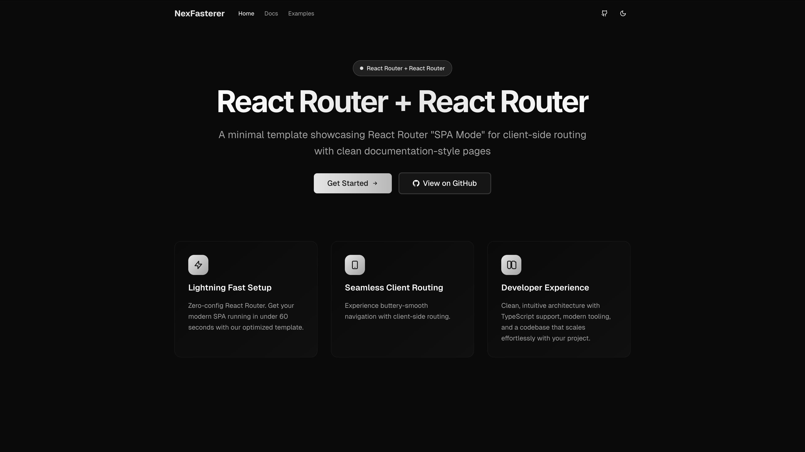

# NexFaster

A minimal template showcasing React Router "SPA Mode" for client-side routing



## 🚀 Quick Start

```bash
git clone https://github.com/rudrodip/nexfaster
cd nexfaster
bun install
bun dev
```

Open [http://localhost:3000](http://localhost:3000) to see the app.

## 🏗️ Architecture

NexFaster uses React Router with [`ssr:false`](https://reactrouter.com/how-to/spa) for pure client-side routing:

## 📁 Key Files

- `react-router.config.ts` - React Router configuration
- `app/root.tsx` - Main React Router application
- `app/config/site.config.ts` - Site configuration

## 🔧 Adding Routes

Add new routes in `app/routes.ts`:

## 🎨 Features

- ⚡ Lightning fast client-side routing
- 🎯 Zero-config React Router integration
- 🎨 Modern UI with Tailwind CSS
- 🌙 Dark mode support
- 📱 Responsive design
- 🔧 TypeScript support

## 🛠️ Tech Stack

- **Framework**: React Router 7
- **Routing**: React Router 7
- **Styling**: Tailwind CSS
- **UI Components**: shadcn/ui
- **Icons**: Lucide React
- **Language**: TypeScript

## 📖 Usage Examples

### Multi-page App

```tsx
<Route path="/products" element={<ProductList />} />
<Route path="/products/:id" element={<ProductDetail />} />
<Route path="/cart" element={<ShoppingCart />} />
```

### Protected Routes

Use [middleware](https://reactrouter.com/changelog#middleware-unstable)

### Nested Layouts

[docs](https://reactrouter.com/start/framework/routing#nested-routes)

## 🤝 Contributing

Contributions are welcome! Please feel free to submit a Pull Request.

## 📄 License

BSD Zero Clause License - see [LICENSE](LICENSE) for details.

## 👤 Credit

This was originally created by [rds_agi](https://rdsx.dev) • [GitHub](https://github.com/rudrodip/nexfaster) • [Twitter](https://x.com/rds_agi)

This is just a fork showing how you can avoid Just Use React Router™
